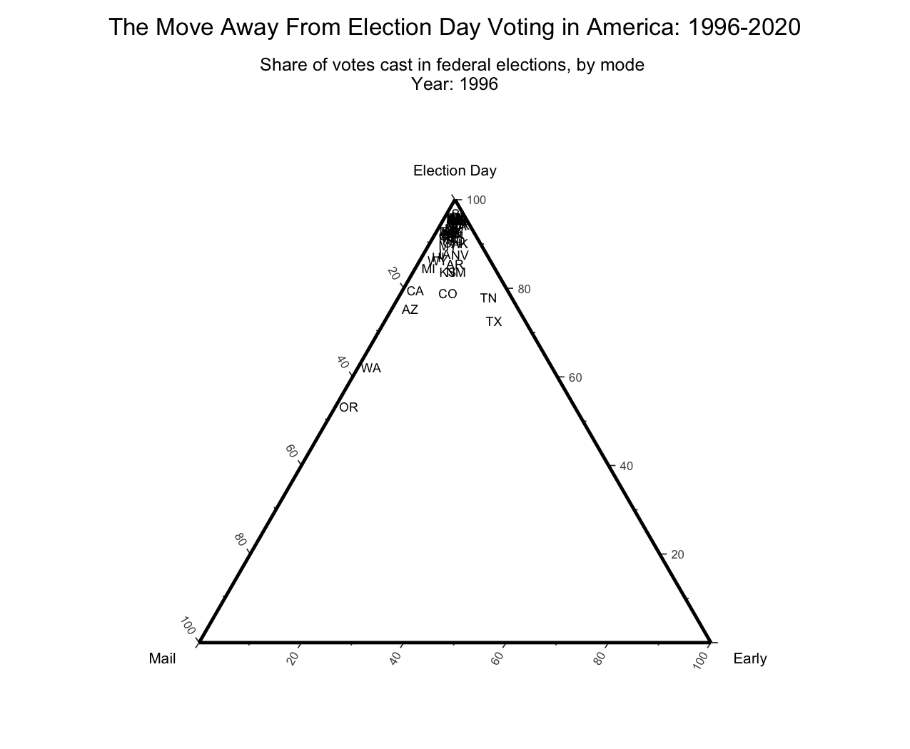

<!-- README.md is generated from README.Rmd. Please edit the Rmd file -->

```{r, include = FALSE}
knitr::opts_chunk$set(
  collapse = TRUE,
  comment = "#>",
  fig.path = "man/figures/README-",
  out.width = "100%", 
  message = FALSE, warning = FALSE,
  knitr.table.format = 'markdown'
)

library(knitr)
devtools::load_all()
set.seed(20201012)
```

# `cpsvote`: A Social Science Toolbox for Using the Current Population Survey's Voting and Registration Supplement

<!-- badges: start -->
[](https://cran.r-project.org/package=cpsvote)
[](https://travis-ci.org/Reed-EVIC/cpsvote)
<!-- badges: end -->

`cpsvote` helps you work with data from the Current Population Survey's (CPS) [Voting and Registration Supplement](https://www.census.gov/topics/public-sector/voting/about.html) (VRS), published by the U.S. Census Bureau and Bureau of Labor Statistics. This high-quality, large-sample survey has been conducted after every federal election (in November of even years) since 1964, surveying Americans about their voting practices and registration. The raw data, archived by the [National Bureau of Economic Research](http://data.nber.org/data/current-population-survey-data.html), is spread across several fixed-width files with different question locations and formats.

This package consolidates common questions and provides the data in a structure that is much easier to work with and interpret, since much of the basic factor recoding has already been done. We also calculate alternative sample weights based on demonstrated changes in non-response bias over the decades, recommended by several elections researchers as a best practice. Documentation of this reweighting is provided in `vignette("voting")`.

We have provided access to VRS data from 1994 to 2020. Currently the 2020 data does not yet include a reweighting for proper voter turnout estimates, but we anticipate updating the package when this data becomes available.

## Installing and Loading the Package

[Version 0.1](https://cran.r-project.org/package=cpsvote) is on CRAN!

```{r eval = FALSE}
install.packages('cpsvote')
library(cpsvote)
```

You can also install the development version from our [GitHub repository](https://github.com/Reed-EVIC/cpsvote).

```{r eval = FALSE}
remotes::install_github("Reed-EVIC/cpsvote")
library(cpsvote)
```

## Basic Use (AKA Tips if You Don't Like Reading Documentation)

We have written several functions to transform the VRS from its original format into a more workable structure. The easiest way to access the data is with the `cps_load_basic()` command:

```{r eval = FALSE}
# Load All Years
# May take some time to download and process files the first time! 
cps <- cps_load_basic()  
```

```{r eval = FALSE}
# Just load 2006 and 2008
cps <- cps_load_basic(years = c(2006, 2008))
```

This will load the prepared VRS data into your environment as a tibble called `cps`. The first time you try to load a given year of data, the raw data file will be downloaded to your computer (defaulting to the relative path "./cps_data"). This can take some time depending on your internet speeds. In future instances, R will just read from the data files that have already been downloaded (defaulting to the same "cps_data" folder), as long as you correctly specify where these are stored. See `?cps_allyears_10k` for a description of the columns and fields that `cps_load_basic()` outputs.

We recommend using a single [R project](https://r4ds.had.co.nz/workflow-projects.html) for your CPS analysis where these files can be stored (this will work with the default options), or storing one set of CPS files in a steady location and specifying this absolute file path each time you load in the data. If you specify a location that does not have the correct files, these functions will attempt to re-download the data from NBER, which can take up noticeable time and storage space.

We have also included a 10,000 row sample of the full VRS data, which comes with the package as `cps_allyears_10k`. This is particularly useful for planning out a given analysis before you download the full data sets.

```{r eval = F, message = F}
library(dplyr)
data("cps_allyears_10k")

cps_allyears_10k %>%
  select(1:3, VRS_VOTE:VRS_REG, VRS_VOTEMETHOD_CON, turnout_weight) %>%
  sample_n(10)
```

```{r echo = F, message = F}
library(dplyr)
data("cps_allyears_10k")

cps_allyears_10k %>%
  select(1:3, VRS_VOTE:VRS_REG, VRS_VOTEMETHOD_CON, turnout_weight) %>%
  sample_n(10) %>%
  kable()
```

The CPS has survey weights that are necessary to calculate accurate estimates about the US population. Two R packages that work with survey weighting are [`survey`](http://r-survey.r-forge.r-project.org/survey/) and [`srvyr`](https://github.com/gergness/srvyr) (a tidyverse-compatible wrapper for `survey`). You can see more examples and details on weighting in `vignette("voting")`, but here is one example of using `srvyr` to calculate state-level voter turnout among eligible voters in 2018.

```{r message=F, warning = F, eval = F}
library(srvyr)

cps18_weighted <- cps_load_basic(years = 2018, datadir = here::here('cps_data')) %>%
  as_survey_design(weights = turnout_weight)

turnout18 <- cps18_weighted %>%
  group_by(STATE) %>%
  summarize(turnout = survey_mean(hurachen_turnout == "YES", na.rm = TRUE))

head(turnout18, 10)
```

```{r message=F, warning = F, echo = F}
library(srvyr)

cps18_weighted <- cps_load_basic(years = 2018, datadir = here::here('cps_data')) %>%
  as_survey_design(weights = turnout_weight)

turnout18 <- cps18_weighted %>%
  group_by(STATE) %>%
  summarize(turnout = survey_mean(hurachen_turnout == "YES", na.rm = TRUE))

head(turnout18, 10) %>%
  kable()
```

These estimates follow closely Dr. Michael McDonald's [estimates of turnout](http://www.electproject.org/2018g) among eligible voters in the November 2018 General Election. For a detailed examination of how non-response bias has affected the use of CPS for estimating turnout, see `vignette("voting")`. We thank the U.S. Elections Project at the University of Florida for the turnout estimates.

## Advanced Use

In addition to the basic function listed above, you can customize several steps in the process of reading in the VRS data. If you've worked with the CPS before, you may already have some code to read in analyze this survey data. We still hope that this package can help you organize your workflow or ease some of the more tedious steps necessary to work with the CPS.

Be sure to refer to the CPS documentation files when working with alternative versions of the VRS data. We have included the function `cps_download_docs()` to provide the documentation versions that match this data. These are all in PDF format (and several are not text-based), so they are not easy to search through.

`cps_load_basic()` is a wrapper for several constituent steps that have their own parameters and assumptions. We've detailed the changes made to get from the raw data file to the cleaned file in `vignette("add-variables")`.

```{r eval=F}
cps_download_data(path = "cps_data",
                  years = seq(1994, 2020, 2))
cps_download_docs(path = "cps_data",
                  years = seq(1994, 2020, 2))

cps_read(years = seq(1994, 2020, 2),
         dir = "cps_data",
         cols = cpsvote::cps_cols,
         names_col = "new_name",
         join_dfs = TRUE) %>%
    cps_label(factors = cpsvote::cps_factors,
              names_col = "new_name",
              na_vals = c("-1", "BLANK", "NOT IN UNIVERSE"),
              expand_year = TRUE,
              rescale_weight = TRUE,
              toupper = TRUE) %>%
    cps_refactor(move_levels = TRUE) %>%
    cps_recode_vote(vote_col = "VRS_VOTE",
                    items = c("DON'T KNOW", "REFUSED", "NO RESPONSE")) %>%
    cps_reweight_turnout()
```

- `cps_download_data()` will download the data files from NBER according to `years` into the folder at `path`. This is automatically called by `cps_read()` when the CPS data files are not found in the provided `dir` - it will search for files with the 4-digit year associated with their data.
- `cps_download_docs()` will downlaod the pdf documentation into `path` for each year supplied in `years`.The documentation here is aligned with the NBER data, and other data sources (such as ICPSR) may have edited the data such that their data or documentation does not line up with the NBER data and documentation. By using the NBER data through `cps_download_docs()`, you can make sure that the fields you look up in documentation are the proper fields referenced in the data.
- `cps_read()` is the function that actually loads in the original, (mostly) numeric data from files defined by the arguments `years` and `dir`. Since the raw data is in fixed-width files, you have to define the range of characters that are read. You can see the default set of columns in the included data set `cps_cols`, or supply `cols` with your own specifications of columns (for details on adding other columns, see `vignette("add-variables")`). The `names_col` argument details which variable in `cols` will become the column names for the output; we have provided the original CPS names as `cps_name`, but recommend using `new_name` as it is more informative and accounts for questions changing names ("PES5", "PES6", etc.) across multiple years. `join_dfs` lets you join multiple years into one `tibble`, and should only be used if you're sure that a column name (like "PES5") refers to the same question across all years you read in.
- `cps_label()` replaces the numeric entries from the raw data with appropriate factor levels (as given by the data documentation; see `cps_download_docs()`). We have taken the factor levels as written from the PDFs, including capitalization, typos, and differences across years. This is provided in the included `cps_factors` dataset, but you can supply the `factors` argument with your own coding (for details on changing factor levels or adding them for a new column, see `vignette("add-variables")`). The `names_col` argument defines which column of `factors` contains the column names that match the incoming data set to be labelled. Further: `na_vals` defines which factor levels should be marked as `NA`, `expand_year` turns the two-digit years in some files into four-digit years (e.g. "94" becomes "1994"), and `rescale_weight` divides the given weight by 10,000 (as noted by the data documentation) to ensure accurate population sums. `toupper` will make all the factor levels upper case, which is useful because as-is the factors are a mix of sentence case and upper case.
- `cps_refactor` deals with all of the typos, capitalization, and shifting questions across years. We have attempted here to consolidate factor levels and variables in a way that makes sense. For example, one common method of assessing vote mode (in-person on Election Day, early in-person, or by mail) has been split between two separate questions from 2004 onwards, and this function consolidates those two questions (and the one question of previous surveys) into one `VRS_VOTEMETHOD_CON` variable. Note that this function will only work with certain column names in the data; see `?cps_refactor` for more details.
- `cps_recode_vote()` recodes the variable `VRS_VOTE` according to two different assessments of voter turnout. The new variable `cps_turnout` will calculate turnout the same way that the Census does, while another new variable `hurachen_turnout` will calculate turnout according to Hur & Achen (2013). These two methods differ in how they count responses of "Don't know", "Refused", and "No response"; see `vignette("background")` for more details.
- `cps_reweight_turnout()` adds a new variable, `turnout_weight`, that reweights the original `WEIGHT` according to Hur & Achen (2013) to account for the adjusted turnout measure. This corrects for increased nonresponse to the VRS over time, as well as a general pattern of respondents overreporting their personal voting history (though the CPS sees less overreporting than other surveys). See `vignette("background")` for details.

You can use different combinations of these functions to customize which CPS data is read in. For example, this code would load the 2014 VRS data with the original column names and numeric data.

```{r eval = FALSE}
cps14 <- cps_read(2014, names_col = "cps_name")
```

You can then apply factor labels to this data.

```{r eval = FALSE}
cps14_lab <- cps_label(cps14, names_col = "cps_name")
```

Note that some features (like `cps_refactor()`) won't work on certain customized versions of the data, because they are relatively hard-coded based on specific column names. For example, correcting "HIPSANIC" to "HISPANIC" only works if you know which column represents the Hispanic flag. Feel free to take the code from functions like this and adapt based on your own column names.

## Examples, Background Reading, and Data Sources

- Vignettes: 
  + `vignette("basics")` provides an intro to the package with some basic instructions for use, and mirrors our [GitHub README](https://github.com/Reed-EVIC/cpsvote)
  + `vignette("background")` describes our intellectual rationale for creating this package
  + `vignette("add-variables")` describes how additional variables from the CPS can be merged with the default dataset
  + `vignette("voting")` does a deep dive into how to use the CPS and the default datasets from `cpsvote` to look at voter turnout and mode of voting
- Aram Hur, Christopher H. Achen. _Coding Voter Turnout Responses in the Current Population Survey_. Public Opinion Quarterly, Volume 77, Issue 4, Winter 2013, Pages 985–993. https://doi.org/10.1093/poq/nft042
- Michael McDonald. _What's Wrong with the CPS?_ Presented at the 2014 American Political Science Association Conference, Washington, D.C., August 27-31. http://www.electproject.org/home/voter-turnout/cps-methodology
- The [Current Population Survey](https://www.census.gov/programs-surveys/cps.html) is conducted monthly by the U.S. Census Bureau and the Bureau of Labor Statistics, and the Voting and Registration Supplement is administered as part of this survey after each federal election. The [CPS data](http://data.nber.org/data/current-population-survey-data.html) that this package downloads is provided by the [National Bureau of Economic Research](https://data.nber.org/info.html).
- This is an animated ternary plot made using vote mode data from `cpsvote`. See NOT YET WRITTEN vignette for the code that created this.



## Acknowledgements

The `cpsvote` package was originally created at the [Early Voting Information Center at Reed College](https://evic.reed.edu/). We are indebted
to support from the [Elections Team at the Democracy Fund](https://democracyfund.org/) and [Reed College](https://www.reed.edu/) for supporting
the work of EVIC. 
