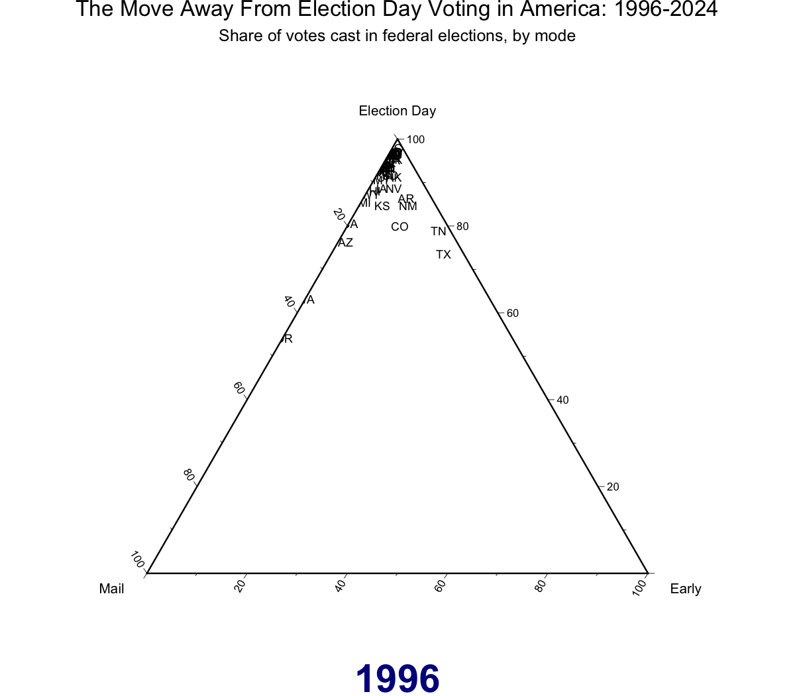

<!-- README.md is generated from README.Rmd. Please edit the Rmd file -->

# `cpsvote`: A Social Science Toolbox for Using the Current Population Survey’s Voting and Registration Supplement

<!-- badges: start -->

[](https://cran.r-project.org/package=cpsvote)
<!-- badges: end -->

`cpsvote` helps you work with data from the Current Population Survey’s
(CPS) [Voting and Registration
Supplement](https://www.census.gov/topics/public-sector/voting/about.html)
(VRS), published by the U.S. Census Bureau and Bureau of Labor
Statistics. This high-quality, large-sample survey has been conducted
after every federal election (in November of even years) since 1964,
surveying Americans about their voting practices and registration. The
raw data, archived by the [National Bureau of Economic
Research](https://www.nber.org/research/data/current-population-survey-cps-supplements-voting-and-registration),
is spread across several fixed-width files with different question
locations and formats.

This package consolidates common questions and provides the data in a
structure that is much easier to work with and interpret, since much of
the basic factor recoding has already been done. We also calculate
alternative sample weights based on demonstrated changes in non-response
bias over the decades, recommended by several elections researchers as a
best practice. Documentation of this reweighting is provided in
`vignette("voting")`.

We have provided access to VRS data from 1994 to 2024.

## Installing and Loading the Package

[Version 0.2](https://cran.r-project.org/package=cpsvote) is on CRAN!

``` r
install.packages('cpsvote')
library(cpsvote)
```

You can also install the development version from our [GitHub
repository](https://github.com/Reed-EVIC/cpsvote).

``` r
remotes::install_github("Reed-EVIC/cpsvote")
library(cpsvote)
```

## Basic Use (AKA Tips if You Don’t Like Reading Documentation)

We have written several functions to transform the VRS from its original
format into a more workable structure. The easiest way to access the
data is with the `cps_load_basic()` command:

``` r
# Load All Years
# May take some time to download and process files the first time! 
cps <- cps_load_basic()  
```

``` r
# Just load 2006 and 2008
cps <- cps_load_basic(years = c(2006, 2008))
```

This will load the prepared VRS data into your environment as a tibble
called `cps`. The first time you try to load a given year of data, the
raw data file will be downloaded to your computer. This can take some
time depending on your internet speeds. In future instances, R will just
read from the data files that have already been downloaded. See
`?cps_allyears_100k` for a description of the columns and fields that
`cps_load_basic()` outputs.

**Data directory:** By default, CPS files are stored in `~/cps_data`
(your home directory). You can check the current default with
`cps_data_dir()`. To use a persistent custom location, add this to your
`.Rprofile`:

``` r
options(cpsvote.datadir = “~/my/path/to/cps_data”)
```

After restarting R, all `cpsvote` data-loading functions will use that
path automatically. If you specify a location that does not have the
correct files, these functions will attempt to re-download the data from
NBER, which can take up noticeable time and storage space.

We have also included a 100,000 row sample of the full VRS data, which
comes with the package as `cps_allyears_100k`. This is particularly
useful for planning out a given analysis before you download the full
data sets.

``` r
library(dplyr)
data("cps_allyears_100k")

cps_allyears_100k %>%
  select(1:3, VRS_VOTE:VRS_REG, VRS_VOTEMETHOD_CON, turnout_weight) %>%
  sample_n(10)
```

| FILE | YEAR | STATE | VRS_VOTE | VRS_REG | VRS_VOTEMETHOD_CON | turnout_weight |
|:---|---:|:---|:---|:---|:---|---:|
| cps_nov2018.zip | 2018 | NJ | NO RESPONSE | NO RESPONSE | NA | 3378.0841 |
| cps_nov1994.zip | 1994 | MI | NO | YES | NA | 1784.3059 |
| cps_nov2000.zip | 2000 | CT | NO RESPONSE | NO RESPONSE | NA | 2444.6010 |
| cps_nov2014.zip | 2014 | VT | YES | NA | ELECTION DAY | 253.6059 |
| cps_nov2024.zip | 2024 | KS | NA | NA | NA | 2041.8559 |
| cps_nov2000.zip | 2000 | AK | NA | NA | NA | 495.0288 |
| cps_nov2020.zip | 2020 | IA | YES | NA | ELECTION DAY | 1783.2662 |
| cps_nov2006.zip | 2006 | VT | YES | NA | ELECTION DAY | 261.6553 |
| cps_nov2002.zip | 2002 | NY | NO | YES | NA | 3623.6069 |
| cps_nov2008.zip | 2008 | AR | YES | NA | ELECTION DAY | 1789.3102 |

The CPS has survey weights that are necessary to calculate accurate
estimates about the US population. Two R packages that work with survey
weighting are [`survey`](http://r-survey.r-forge.r-project.org/survey/)
and [`srvyr`](https://github.com/gergness/srvyr) (a tidyverse-compatible
wrapper for `survey`). You can see more examples and details on
weighting in `vignette("voting")`, but here is one example of using
`srvyr` to calculate state-level voter turnout among eligible voters in
2020.

``` r
library(srvyr)

cps20_weighted <- cps_load_basic(years = 2020, datadir = here::here('cps_data')) %>%
  as_survey_design(weights = turnout_weight)

turnout20 <- cps20_weighted %>%
  group_by(STATE) %>%
  summarize(turnout = survey_mean(hurachen_turnout == "YES", na.rm = TRUE))

head(turnout20, 10)
```

| STATE |   turnout | turnout_se |
|:------|----------:|-----------:|
| AL    | 0.4827207 |  0.0123850 |
| AK    | 0.5670961 |  0.0178198 |
| AZ    | 0.5997274 |  0.0154234 |
| AR    | 0.4270782 |  0.0131359 |
| CA    | 0.5554578 |  0.0066525 |
| CO    | 0.5998372 |  0.0173296 |
| CT    | 0.5806014 |  0.0191721 |
| DE    | 0.5926931 |  0.0174831 |
| DC    | 0.5937632 |  0.0234803 |
| FL    | 0.5534077 |  0.0085969 |

These estimates follow closely Dr. Michael McDonald’s [estimates of
turnout](https://www.electproject.org/2020g) among eligible voters in the
November 2020 General Election. For a detailed examination of how
non-response bias has affected the use of CPS for estimating turnout,
see `vignette("voting")`. We thank the U.S. Elections Project at the
University of Florida for the turnout estimates.

## Advanced Use

In addition to the basic function listed above, you can customize
several steps in the process of reading in the VRS data. If you’ve
worked with the CPS before, you may already have some code to read in
analyze this survey data. We still hope that this package can help you
organize your workflow or ease some of the more tedious steps necessary
to work with the CPS.

Be sure to refer to the CPS documentation files when working with
alternative versions of the VRS data. We have included the function
`cps_download_docs()` to provide the documentation versions that match
this data. These are all in PDF format (and several are not text-based),
so they are not easy to search through.

`cps_load_basic()` is a wrapper for several constituent steps that have
their own parameters and assumptions. We’ve detailed the changes made to
get from the raw data file to the cleaned file in
`vignette("add-variables")`.

``` r
cps_download_data(path = "cps_data",
                  years = seq(1994, 2020, 2))
cps_download_docs(path = "cps_data",
                  years = seq(1994, 2020, 2))

cps_read(years = seq(1994, 2020, 2),
         dir = "cps_data",
         cols = cpsvote::cps_cols,
         names_col = "new_name",
         join_dfs = TRUE) %>%
    cps_label(factors = cpsvote::cps_factors,
              names_col = "new_name",
              na_vals = c("-1", "BLANK", "NOT IN UNIVERSE"),
              expand_year = TRUE,
              rescale_weight = TRUE,
              toupper = TRUE) %>%
    cps_refactor(move_levels = TRUE) %>%
    cps_recode_vote(vote_col = "VRS_VOTE",
                    items = c("DON'T KNOW", "REFUSED", "NO RESPONSE")) %>%
    cps_reweight_turnout()
```

- `cps_download_data()` will download the data files from NBER according
  to `years` into the folder at `path`. This is automatically called by
  `cps_read()` when the CPS data files are not found in the provided
  `dir` - it will search for files with the 4-digit year associated with
  their data.
- `cps_download_docs()` will downlaod the pdf documentation into `path`
  for each year supplied in `years`.The documentation here is aligned
  with the NBER data, and other data sources (such as ICPSR) may have
  edited the data such that their data or documentation does not line up
  with the NBER data and documentation. By using the NBER data through
  `cps_download_docs()`, you can make sure that the fields you look up
  in documentation are the proper fields referenced in the data.
- `cps_read()` is the function that actually loads in the original,
  (mostly) numeric data from files defined by the arguments `years` and
  `dir`. Since the raw data is in fixed-width files, you have to define
  the range of characters that are read. You can see the default set of
  columns in the included data set `cps_cols`, or supply `cols` with
  your own specifications of columns (for details on adding other
  columns, see `vignette("add-variables")`). The `names_col` argument
  details which variable in `cols` will become the column names for the
  output; we have provided the original CPS names as `cps_name`, but
  recommend using `new_name` as it is more informative and accounts for
  questions changing names (“PES5”, “PES6”, etc.) across multiple years.
  `join_dfs` lets you join multiple years into one `tibble`, and should
  only be used if you’re sure that a column name (like “PES5”) refers to
  the same question across all years you read in.
- `cps_label()` replaces the numeric entries from the raw data with
  appropriate factor levels (as given by the data documentation; see
  `cps_download_docs()`). We have taken the factor levels as written
  from the PDFs, including capitalization, typos, and differences across
  years. This is provided in the included `cps_factors` dataset, but you
  can supply the `factors` argument with your own coding (for details on
  changing factor levels or adding them for a new column, see
  `vignette("add-variables")`). The `names_col` argument defines which
  column of `factors` contains the column names that match the incoming
  data set to be labelled. Further: `na_vals` defines which factor
  levels should be marked as `NA`, `expand_year` turns the two-digit
  years in some files into four-digit years (e.g. “94” becomes “1994”),
  and `rescale_weight` divides the given weight by 10,000 (as noted by
  the data documentation) to ensure accurate population sums. `toupper`
  will make all the factor levels upper case, which is useful because
  as-is the factors are a mix of sentence case and upper case.
- `cps_refactor` deals with all of the typos, capitalization, and
  shifting questions across years. We have attempted here to consolidate
  factor levels and variables in a way that makes sense. For example,
  one common method of assessing vote mode (in-person on Election Day,
  early in-person, or by mail) has been split between two separate
  questions from 2004 onwards, and this function consolidates those two
  questions (and the one question of previous surveys) into one
  `VRS_VOTEMETHOD_CON` variable. Note that this function will only work
  with certain column names in the data; see `?cps_refactor` for more
  details.
- `cps_recode_vote()` recodes the variable `VRS_VOTE` according to two
  different assessments of voter turnout. The new variable `cps_turnout`
  will calculate turnout the same way that the Census does, while
  another new variable `hurachen_turnout` will calculate turnout
  according to Hur & Achen (2013). These two methods differ in how they
  count responses of “Don’t know”, “Refused”, and “No response”; see
  `vignette("background")` for more details.
- `cps_reweight_turnout()` adds a new variable, `turnout_weight`, that
  reweights the original `WEIGHT` according to Hur & Achen (2013) to
  account for the adjusted turnout measure. This corrects for increased
  nonresponse to the VRS over time, as well as a general pattern of
  respondents overreporting their personal voting history (though the
  CPS sees less overreporting than other surveys). See
  `vignette("background")` for details.

You can use different combinations of these functions to customize which
CPS data is read in. For example, this code would load the 2014 VRS data
with the original column names and numeric data.

``` r
cps14 <- cps_read(2014, names_col = "cps_name")
```

You can then apply factor labels to this data.

``` r
cps14_lab <- cps_label(cps14, names_col = "cps_name")
```

Note that some features (like `cps_refactor()`) won’t work on certain
customized versions of the data, because they are relatively hard-coded
based on specific column names. For example, correcting “HIPSANIC” to
“HISPANIC” only works if you know which column represents the Hispanic
flag. Feel free to take the code from functions like this and adapt
based on your own column names.

## Examples, Background Reading, and Data Sources

- Vignettes:
  - `vignette("basics")` provides an intro to the package with some
    basic instructions for use, and mirrors our [GitHub
    README](https://github.com/Reed-EVIC/cpsvote)
  - `vignette("background")` describes our intellectual rationale for
    creating this package
  - `vignette("add-variables")` describes how additional variables from
    the CPS can be merged with the default dataset
  - `vignette("voting")` does a deep dive into how to use the CPS and
    the default datasets from `cpsvote` to look at voter turnout and
    mode of voting
- Aram Hur, Christopher H. Achen. *Coding Voter Turnout Responses in the
  Current Population Survey*. Public Opinion Quarterly, Volume 77, Issue
  4, Winter 2013, Pages 985–993. <https://doi.org/10.1093/poq/nft042>
- Michael McDonald. *What’s Wrong with the CPS?* Presented at the 2014
  American Political Science Association Conference, Washington, D.C.,
  August 27-31.
  <https://www.electproject.org/home/voter-turnout/cps-methodology>
- The [Current Population
  Survey](https://www.census.gov/programs-surveys/cps.html) is conducted
  monthly by the U.S. Census Bureau and the Bureau of Labor Statistics,
  and the Voting and Registration Supplement is administered as part of
  this survey after each federal election. The [CPS
  data](https://www.nber.org/research/data/current-population-survey-cps-supplements-voting-and-registration)
  that this package downloads is provided by the [National Bureau of
  Economic Research](https://www.nber.org).
- This is an animated ternary plot made using vote mode data from
  `cpsvote`. The code that created this in available in the “The Move
  Away From Election Day Voting in America: The Snowglobe Plot”
  vignette.



## Acknowledgements

The `cpsvote` package was originally created at the [Elections & Voting
Information Center at Reed College](https://evic.reed.edu/), now
colocated at [Center for Public Service at Portland State
University](http://electionsandvoting.org).
